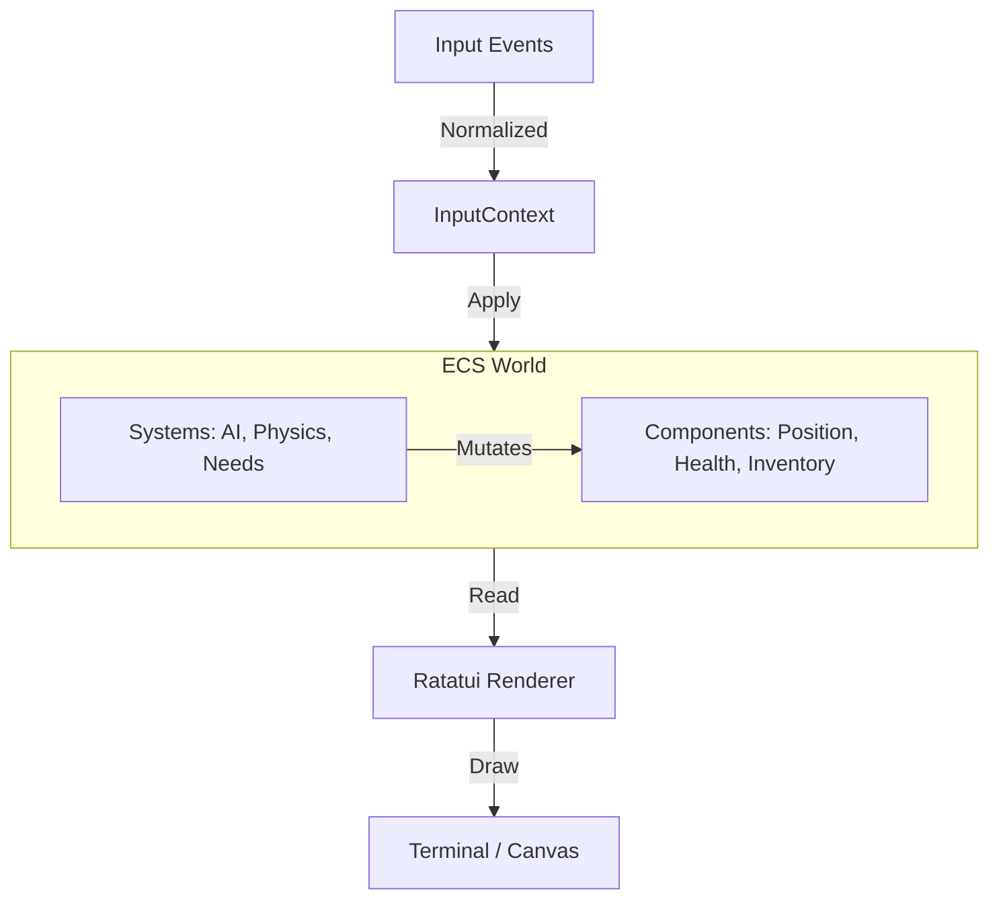

# SCALE Architecture

*From pebble to empire. Every world remembers.*

This document details the technical architecture of SCALE. For gameplay concepts and vision, see the `README.md`.

## Core Philosophy

1.  **Scale is a Camera**: The simulation persists across all zoom levels. The colony doesn't stop simulating when you zoom out to the galaxy map.
2.  **Every Problem Has a Face**: Abstract numbers (unrest, hunger) are driven by individual agents (Pops) with names, histories, and grievances.
3.  **Losing is Interesting**: Failure states should be narrative events (civil war, starvation, collapse), not game-over screens.

## Technical Stack

*   **Language**: Rust (2024 Edition)
*   **Simulation Engine**: `bevy_ecs` (Entity Component System)
*   **UI Framework**: `ratatui` (Terminal UI)
*   **Platform Abstraction**:
    *   **Native**: `crossterm` for terminal rendering.
    *   **Web**: `ratzilla` (custom wrapper) for WASM/Canvas rendering.
*   **Serialization**: `serde` for save/load and config.

## Architecture Layers

The game is structured into three simulation layers, each abstracting the one below while remaining connected.

### 1. Colony Layer (`src/layer1/`)

The "Dwarf Fortress" mode. This is the detailed simulation layer where individual Pops live and work.

*   **Grid**: A 2D tile map (`TerrainGrid`) handling pathfinding, fluids, and diffusion.
*   **Agents (Pops)**:
    *   **Needs**: Hunger, Rest, Leisure, Social (see `src/layer1/needs.rs`).
    *   **Utility AI**: A scoring system (`evaluate_actions_system`) that selects the best `ActionType` based on needs and environment (see `src/layer1/utility_ai.rs`).
    *   **Memory**: Pops remember events (`Memories`) which influence their `UtilityWeights` (personality) (see `src/layer1/memory.rs`).
*   **Systems**:
    *   `metabolism_system`: Decays needs over time.
    *   `movement_system`: Moves entities along paths.
    *   `work_execution_system`: Progresses tasks (Mining, Building, Crafting).
    *   `social_system`: Handles interactions and gossip.

### 2. System Layer (*Planned*)

The "Planetary" mode. Represents the star system.

*   **Nodes**: Planets, Asteroid Belts, Stations.
*   **Fleets**: Groups of ships moving between nodes.
*   **Abstraction**: Colony simulation is simplified (statistical) when not in focus, but key events still trigger.

### 3. Galaxy Layer (*Planned*)

The "Stellaris" mode. Represents the galaxy.

*   **Star Systems**: Connected by hyperlanes.
*   **Civilizations**: High-level factions competing for territory.
*   **Diplomacy**: Wars, alliances, and trade.

## Data Flow

The game runs a strict "Update -> Render" loop, decoupled by the platform layer.

### 1. Input Handling (`src/shared/input.rs`)
Raw events (Key presses, Mouse clicks) are captured by the platform backend (`crossterm` or `ratzilla`) and converted into a generic `InputContext` event.

### 2. Simulation Tick (`src/simulation.rs`)
The `run_simulation_tick` function advances the world state by one discrete step.
*   **Time**: `SimulationTime` resource increments.
*   **Schedule**: A set of `bevy_ecs` systems runs in parallel where possible.
*   **Determinism**: The simulation is designed to be deterministic given the same seed and input (mostly - floating point determinism is a goal, not a guarantee yet).

### 3. Rendering (`src/ui/`)
The UI is strictly **read-only** with respect to the simulation state.
*   It queries the ECS World.
*   It constructs a generic `ratatui::Frame`.
*   It draws widgets (Map, Inspector, Chronicle) to the screen buffer.

## Key Modules

### Utility AI (`src/layer1/utility_ai.rs`)
The brain of the colony. It uses a **Utility-based architecture**.
*   **Scoring**: Each potential action (Eat, Sleep, Work) is scored (0.0 - 1.0).
*   **Context**: Distance, tool availability, and social factors modify the score.
*   **Commitment**: Pops commit to an action for a duration to prevent dithering.

### Procedural Narrative (`src/shared/narrative.rs`, `src/layer1/chronicle.rs`)
The "Storyteller" engine.
*   **Lore**: Loaded from `lore/` (Markdown files).
*   **Generation**: Uses templates and grammars to generate text for events.
*   **Chronicle**: Records significant events (Deaths, Discoveries) into a history log.
*   **Rumors**: Pops spread these events as gossip, potentially distorting the truth.

### Grid & Pathfinding (`src/layer1/map.rs`, `src/layer1/terrain.rs`)
*   **Terrain**: Static grid (Grass, Rock, Water).
*   **Pathfinding**: A* algorithm handles navigation, respecting terrain cost and obstacles.
*   **Fluids/Gases**: `AtmosphereGrid` and `PressureGrid` simulate diffusion of gases and temperature.

## Contributing

See `AGENTS.md` for the AI-driven development protocol.
