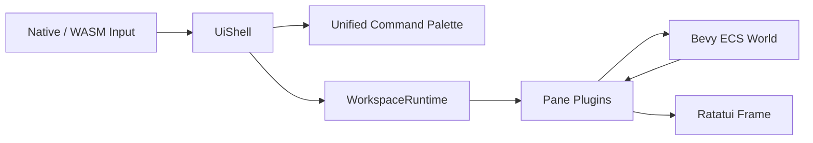

# 048. Adopt A Hypertile Shell For TUI Composition

## Status

Accepted

## Context

SCALE's terminal UI was orchestrated from a fixed root layout in `src/ui/mod.rs`. That model hard-coded the map, inspector, status bar, chronicle, and tech tree into one rendering path. It worked for a single opinionated HUD, but it broke down once the interface needed to support:

- movable and resizable panes,
- workspace-style layouts,
- a cohesive command palette,
- shell state persisted separately from simulation state,
- chronicle and tech as normal views instead of modal overlays.

The old input architecture also mixed shell concerns and gameplay concerns in `InputContextStack`, which made pane management and palette-style navigation awkward. Implicit layout decisions had become technical debt.

## Decision

Adopt `ratatui-hypertile-extras` as the top-level application shell for SCALE's native and WASM TUI entry points.

The shell now owns:

- workspace tabs (`Colony Ops`, `System Survey`, `Director`),
- pane composition and focus,
- a unified command palette opened with `Ctrl+K`,
- layout-mode entry through shell commands,
- persisted workspace and pane state via `ShellConfig`.

Existing UI surfaces are wrapped as shell plugins instead of being recomposed by one fixed root layout:

- colony map,
- system map,
- inspector,
- status,
- chronicle,
- tech tree.

Chronicle and tech are promoted from overlay-specific UI state to first-class panes. Gameplay hotkeys that used to open overlays now route through shell commands which focus or create panes.

## Consequences

- Pane layout is now explicit, reusable, and user-rearrangeable instead of being buried in one render function.
- Chronicle and tech no longer depend on overlay-open flags for visibility.
- Shell persistence can fall back to `Colony Ops` when saved layout data is corrupt or stale.
- Input routing is clearer: shell-level commands and pane-local actions have a defined boundary.
- The UI stack is more powerful, but it now depends on maintaining shell/plugin contracts and serialized layout compatibility over time.
