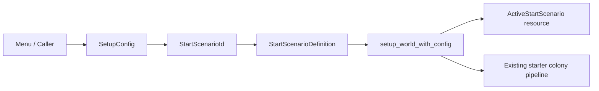

# 049. Adopt Scenario-Driven Startup Plumbing

## Status

Accepted

## Context

SCALE's startup path in `src/setup.rs` assumed one hardcoded opening flow. The world generator produced terrain and history, then the game always spawned the same starter colony shell and the same initial population pattern. That made the opening mechanically uniform even when the generated lore differed.

The validated roadmap for start scenarios requires curated openings such as `Ground Survival`, `Social Drama`, and `Layer 2 Ready`. Those starts should eventually alter population composition, material posture, and opening pressure. Without a startup framework, adding them would force the codebase toward duplicated setup branches and brittle menu-specific conditionals.

We needed a first slice that changes startup architecture without changing current default gameplay behavior.

## Decision

Adopt a scenario-driven startup framework in `src/setup.rs`.

The framework introduces:

- a stable `StartScenarioId` enum for built-in starts,
- centralized `StartScenarioDefinition` metadata,
- a `scenario` field on `SetupConfig`,
- an `ActiveStartScenario` resource inserted during world setup.

The initial implementation records the selected scenario but preserves the current `Classic` opening behavior and shared landing layout. Scenario-specific mutations are deferred to follow-up specs.

## Consequences

- Startup now has an explicit hook for curated openings instead of implicit hardcoded assumptions.
- Existing callers must either populate `scenario` or inherit the `Classic` default via `..Default::default()`.
- Future scenario content can be layered onto one setup pipeline instead of copy-pasting world initialization.
- The current physical landing layout remains unchanged, which keeps this first slice low risk but means scenario identity is not player-visible yet.
