# SCALE Architecture

This document maps the high-level architecture of the SCALE project.

## High-Level Components

```mermaid
C4Component
title Component Diagram - SCALE System Architecture

Container(Main, "Main Entry", "Rust/Crossterm", "Initializes World, runs Game Loop")

Container_Boundary(StorageBox, "Storage Crate") {
    Component(Storage, "Storage Module", "storage/*", "Implements Persistence Traits")
}

Container_Boundary(Simulation, "Simulation Core (Layer 1)") {
    Component(SystemOrchestrator, "System Orchestrator", "layer1/systems/*", "Registers & Orders Systems")
    Component(UtilityOrchestrator, "Utility Orchestrator", "utility_ai.rs", "Coordinates Decision Cycle")
    Component(GPU, "GPU Compute", "gpu/evaluate.rs", "Parallel Scoring")
    Component(UtilityTypes, "Utility Types", "utility_types.rs", "Shared Action Definitions")
    Component(Actions, "Action Modules", "layer1/actions/*", "Generic Actions")
    Component(DomainActions, "Domain Actions", "medical.rs, funeral.rs", "Specific Logic")

    Component(Pops, "Pops", "pop.rs", "Agents with Needs & Thoughts")
    Component(Execution, "Execution Logic", "execution.rs", "Applies Actions")
    Component(Factions, "Factions", "factions.rs", "Guilds & Strikes")
    Component(SpontaneousArch, "Spontaneous Arch", "spontaneous_architecture.rs", "Agent Building")
    Component(CabinFever, "Cabin Fever System", "cabin_fever.rs", "Tracks Confinement & Crowding")
    Component(GutBiome, "Gut Biome", "gut_biome.rs", "Digestive Adaptation")
    Component(Acoustics, "Acoustics (Nova)", "acoustics.rs", "Noise Map & Weather Audio")
    Component(Seismic, "Seismic Grid", "geology/mod.rs", "Long-term Stress")
    Component(Vibration, "Vibration Grid", "seismic.rs", "Immediate Vibration")
    Component(Atmosphere, "Atmosphere", "atmosphere.rs", "Pollution Diffusion")
    Component(Pressure, "Pressure", "pressure.rs", "Decompression")
    Component(Pathfinding, "Pathfinding", "pathfinding.rs", "A* with Capabilities")
    Component(World, "World Entities", "farm.rs, housing.rs", "Interactable Buildings")
    Component(Resources, "Colony Resources", "resources.rs", "Global Inventory")
    Component(Logistics, "Logistics System", "logistics/*.rs", "Conveyors & Pneumatics")
    Component(Map, "Map/Terrain", "map.rs", "Spatial Grid")

    Component(CoreTraits, "Core Traits", "core/traits.rs", "Defines Storage Bounds")

    Component(Particles, "Particle System", "particles.rs", "Visual Juice & Sub-grid Physics")
    Component(NovaFeatures, "Nova Features", "constellations.rs, observer.rs", "Experimental Mechanics")
}

Container_Boundary(SystemSim, "System Simulation (Layer 2)") {
    Component(Fleets, "Fleets", "fleet.rs, ship.rs", "Mobile Units & Travel")
    Component(Orbits, "Orbital System", "system.rs", "Planets & Stations")
    Component(Debris, "Orbital Debris", "debris.rs", "Hazard & Risk")
    Component(Mining, "Mining Ops", "mining.rs", "Resource Extraction")
    Component(Stations, "Stations", "station.rs", "Static Orbital Structures")

    Rel(Fleets, Orbits, "Orbits/Transit")
    Rel(Fleets, Debris, "Takes Damage")
    Rel(Fleets, Mining, "Extracts Resources")
    Rel(Mining, Orbits, "Target")
}

Container(Shared, "Shared Lib", "Utilities", "GameState, Time, Input, Logs")

Container_Boundary(SharedLib, "Shared Components") {
    Component(InputStack, "Input Context Stack", "input.rs", "Modal Input Handling")
}

Container_Boundary(UI, "UI Layer") {
    Component(MapRender, "Map Module", "map.rs", "Renders Grid & Entities")
    Component(Inspector, "Inspector Module", "inspector.rs", "Renders Details")
    Component(Chronicle, "Chronicle Module", "chronicle.rs", "Renders Logs")
    Component(Status, "Status Module", "status.rs", "Renders Top Bar")
}

Rel(Main, Shared, "Uses")
Rel(Main, SystemOrchestrator, "Registers Systems")
Rel(SystemOrchestrator, UtilityOrchestrator, "Schedules")
Rel(UtilityOrchestrator, GPU, "Dispatches Work")
Rel(Main, MapRender, "Calls Render")

Rel(UtilityOrchestrator, Actions, "Calls evaluate_*")
Rel(UtilityOrchestrator, DomainActions, "Calls evaluate_*")
Rel(UtilityOrchestrator, Pops, "Reads/Writes")
Rel(Execution, UtilityTypes, "Uses Shared Types")
Rel(Execution, Pops, "Updates")
Rel(Pops, UtilityTypes, "Uses PopAction")
Rel(UtilityOrchestrator, UtilityTypes, "Uses Weights")
Rel(UtilityOrchestrator, World, "Queries Availability")
Rel(UtilityOrchestrator, Map, "Calculates Distance")
Rel(UtilityOrchestrator, Pathfinding, "Calculates Path")

Rel(CoreTraits, Storage, "Uses (Trait Bound)")

Rel(Actions, Particles, "Spawns")
Rel(DomainActions, Particles, "Spawns")

Rel(Pops, World, "Interacts with")
Rel(Pops, GutBiome, "Adapts to Diet")
Rel(Pops, Factions, "Member Of")
Rel(Pops, Resources, "Consumes/Produces")
Rel(Pops, CabinFever, "Accumulates Stress")
Rel(Pops, Acoustics, "Reacts to Noise")
    Rel(Pops, Vibration, "Reacts to Vibration")
Rel(Pops, SpontaneousArch, "Builds")
Rel(Pops, Atmosphere, "Takes Damage")
Rel(Pops, Pressure, "Moved by Force")
Rel(Pops, NovaFeatures, "Affected By")

Rel(Logistics, Map, "Reads/Writes")
Rel(Logistics, Resources, "Moves Items")
Rel(Logistics, World, "Connects Buildings")

Rel(MapRender, Shared, "Reads State")
Rel(MapRender, Map, "Reads Entities")
Rel(Inspector, Shared, "Reads Selection")
Rel(Inspector, Pops, "Reads Components")
```

## Layer 1 Security & Access Architecture

The simulation distinguishes between physical movement restrictions and biometric clearances.

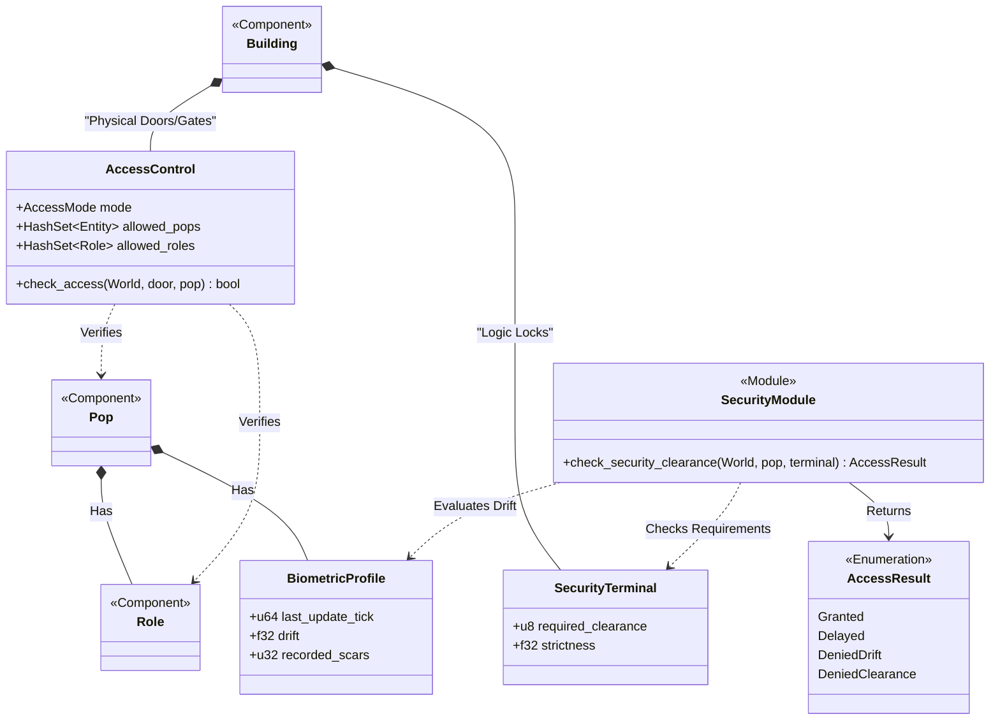
```mermaid
classDiagram
    class AccessControl {
        +AccessMode mode
        +HashSet~Entity~ allowed_pops
        +HashSet~Role~ allowed_roles
        +check_access(World, door, pop) bool
    }
    class Building {
        <<Component>>
    }
    class Pop {
        <<Component>>
    }
    class Role {
        <<Component>>
    }

    class SecurityTerminal {
        +u8 required_clearance
        +f32 strictness
    }
    class BiometricProfile {
        +u64 last_update_tick
        +f32 drift
        +u32 recorded_scars
    }
    class AccessResult {
        <<Enumeration>>
        Granted
        Delayed
        DeniedDrift
        DeniedClearance
    }
    class SecurityModule {
        <<Module>>
        +check_security_clearance(World, pop, terminal) AccessResult
    }

    Building *-- AccessControl : "Physical Doors/Gates"
    Pop *-- Role : Has
    Pop *-- BiometricProfile : Has
    Building *-- SecurityTerminal : "Logic Locks"

    AccessControl ..> Pop : Verifies
    AccessControl ..> Role : Verifies

    SecurityModule ..> BiometricProfile : Evaluates Drift
    SecurityModule ..> SecurityTerminal : Checks Requirements
    SecurityModule --> AccessResult : Returns
```

## Layer 2 Bridge

The interface between the Colony Simulation (Layer 1) and the Orbital/System Data (Layer 2).

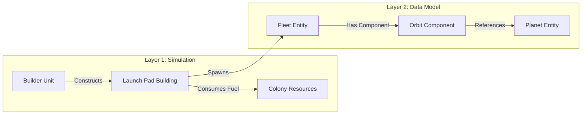
```mermaid
graph LR
    subgraph Layer 1: Simulation
        Colony[Colony Resources]
        Builder[Builder Unit]
        LP[Launch Pad Building]
    end

    subgraph Layer 2: Data Model
        Fleet[Fleet Entity]
        Orbit[Orbit Component]
        Planet[Planet Entity]
    end

    Builder -->|Constructs| LP
    LP -->|Consumes Fuel| Colony
    LP -->|Spawns| Fleet
    Fleet -->|Has Component| Orbit
    Orbit -->|References| Planet
```

## Layer 2: Orbital Simulation

Layer 2 uses abstract, timer-based simulation instead of grid physics.

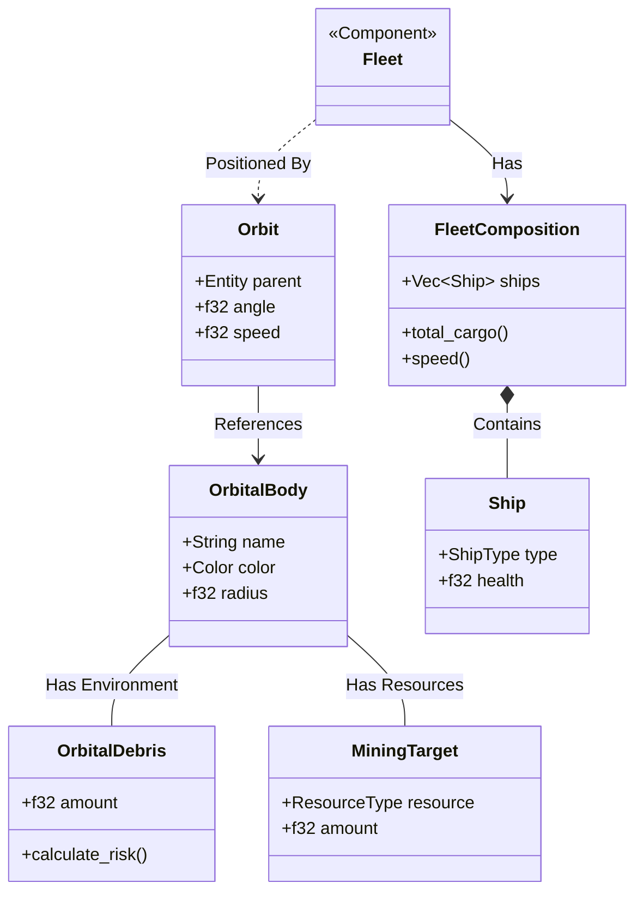
```mermaid
classDiagram
    class OrbitalBody {
        +String name
        +Color color
        +f32 radius
    }
    class Orbit {
        +Entity parent
        +f32 angle
        +f32 speed
    }
    class Fleet {
        <<Component>>
    }
    class FleetComposition {
        +Vec~Ship~ ships
        +total_cargo()
        +speed()
    }
    class Ship {
        +ShipType type
        +f32 health
    }
    class OrbitalDebris {
        +f32 amount
        +calculate_risk()
    }
    class MiningTarget {
        +ResourceType resource
        +f32 amount
    }

    Fleet --> FleetComposition : Has
    FleetComposition *-- Ship : Contains
    Fleet ..> Orbit : Positioned By
    Orbit --> OrbitalBody : References
    OrbitalBody -- OrbitalDebris : Has Environment
    OrbitalBody -- MiningTarget : Has Resources
```

## The Game Loop

SCALE uses a hybrid architecture: `bevy_ecs` for logic and `ratatui` for rendering, managed by a custom loop.

### Layer 1 Execution Flow

The simulation frame is divided into strict phases using `Layer1SystemSet` to ensure causality (e.g., Production happens before Consumption).

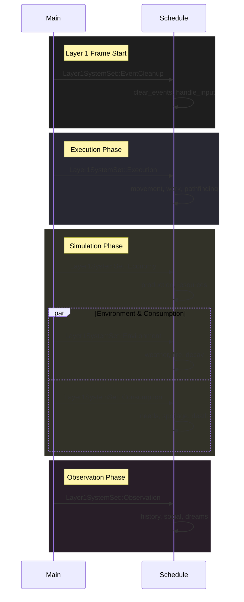
```mermaid
sequenceDiagram
    participant Main
    participant Schedule

    rect rgb(30, 30, 30)
        note right of Main: Layer 1 Frame Start
        Main->>Schedule: Layer1SystemSet::EventCleanup
        Schedule->>Schedule: clear_events, handle_input
    end

    rect rgb(40, 40, 50)
        note right of Main: Execution Phase
        Main->>Schedule: Layer1SystemSet::Execution
        Schedule->>Schedule: movement, work, pathfinding
    end

    rect rgb(50, 50, 40)
        note right of Main: Simulation Phase
        Main->>Schedule: Layer1SystemSet::Economy
        Schedule->>Schedule: production, resources

        par Environment & Consumption
            Main->>Schedule: Layer1SystemSet::Environment
            Schedule->>Schedule: weather, fire, decay
        and
            Main->>Schedule: Layer1SystemSet::Consumption
            Schedule->>Schedule: needs, spoilage, death
        end
    end

    rect rgb(40, 30, 40)
        note right of Main: Observation Phase
        Main->>Schedule: Layer1SystemSet::Observation
        Schedule->>Schedule: history, social, dreams
    end
```

### Frame Sequence

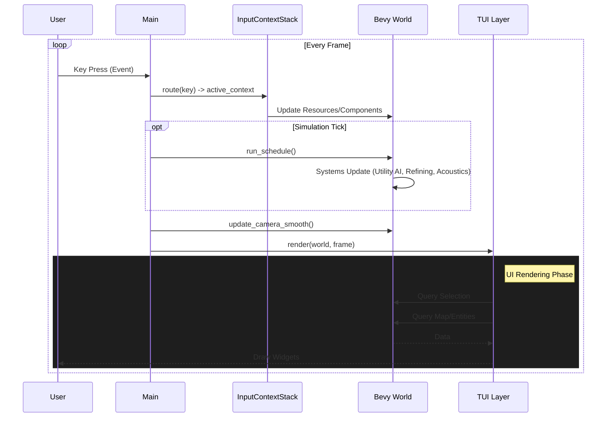
```mermaid
sequenceDiagram
    participant User
    participant Main
    participant Input as InputContextStack
    participant ECS as Bevy World
    participant UI as TUI Layer

    loop Every Frame
        User->>Main: Key Press (Event)
        Main->>Input: route(key) -> active_context
        Input->>ECS: Update Resources/Components

        opt Simulation Tick
            Main->>ECS: run_schedule()
            ECS->>ECS: Systems Update (Utility AI, Refining, Acoustics)
        end

        Main->>ECS: update_camera_smooth()
        Main->>UI: render(world, frame)

        rect rgb(30, 30, 30)
            note right of UI: UI Rendering Phase
            UI->>ECS: Query Selection
            UI->>ECS: Query Map/Entities
            ECS-->>UI: Data
            UI-->>User: Draw Widgets
        end
    end
```

## Core to Storage Relationship

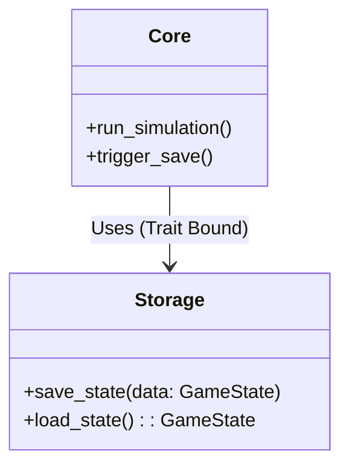
```mermaid
classDiagram
  class Core {
      +run_simulation()
      +trigger_save()
  }
  class Storage {
      +save_state(data: GameState)
      +load_state() : GameState
  }

  Core --> Storage : Uses (Trait Bound)
  %% The circular dependency back to Core has been removed
```

## Storage Serialization Flow

The new storage module handles serializing the core state without circular dependencies.

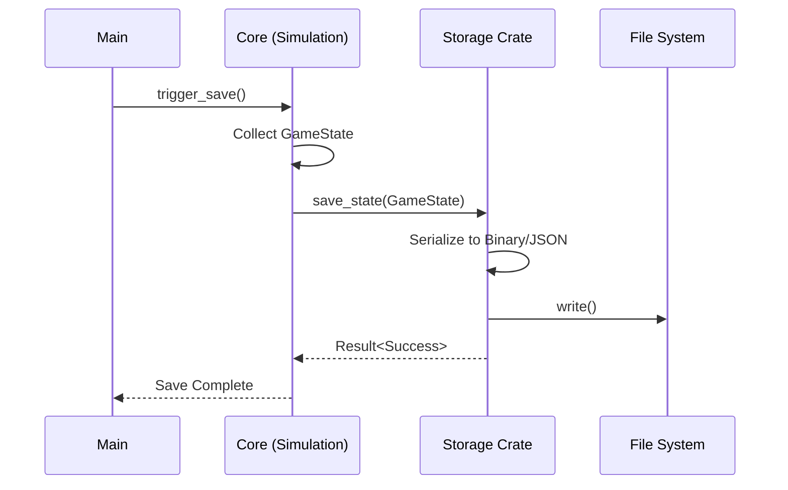
```mermaid
sequenceDiagram
    participant Main
    participant Core as Core (Simulation)
    participant Storage as Storage Crate
    participant Disk as File System

    Main->>Core: trigger_save()
    Core->>Core: Collect GameState
    Core->>Storage: save_state(GameState)
    Storage->>Storage: Serialize to Binary/JSON
    Storage->>Disk: write()
    Storage-->>Core: Result<Success>
    Core-->>Main: Save Complete
```

## Headless CLI Environment

The SCALE system supports headless interactions without an active graphical terminal via the `headless.rs` binary. This environment executes simulation logic synchronously in a command-driven fashion.

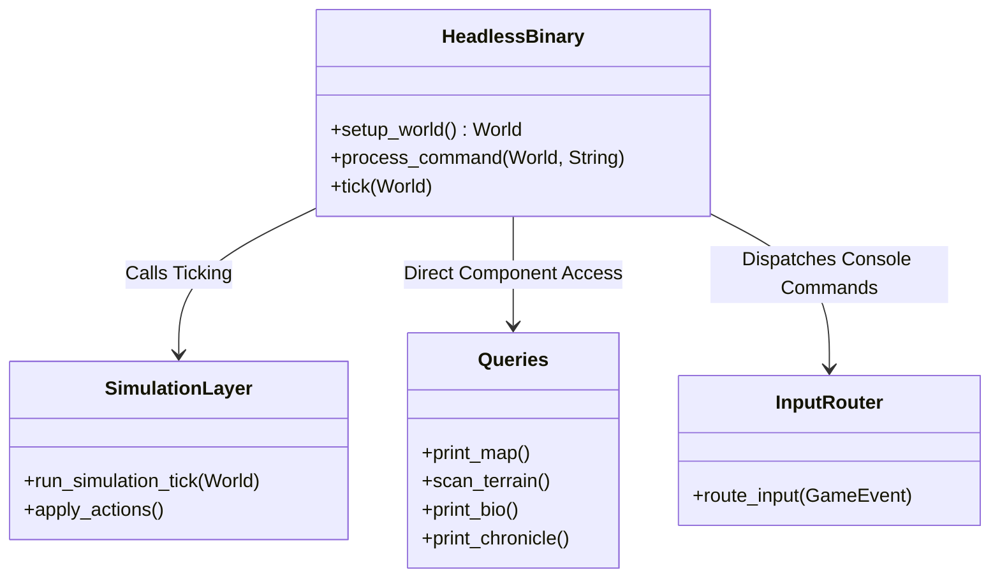
```mermaid
classDiagram
  class HeadlessBinary {
      +setup_world() World
      +process_command(World, String)
      +tick(World)
  }

  class SimulationLayer {
      +run_simulation_tick(World)
      +apply_actions()
  }

  class Queries {
      +print_map()
      +scan_terrain()
      +print_bio()
      +print_chronicle()
  }

  class InputRouter {
      +route_input(GameEvent)
  }

  HeadlessBinary --> SimulationLayer : Calls Ticking
  HeadlessBinary --> Queries : Direct Component Access
  HeadlessBinary --> InputRouter : Dispatches Console Commands
```

## Utility AI Decision Loop

The "Brain" of the simulation. Pops decide what to do based on internal needs and external context.

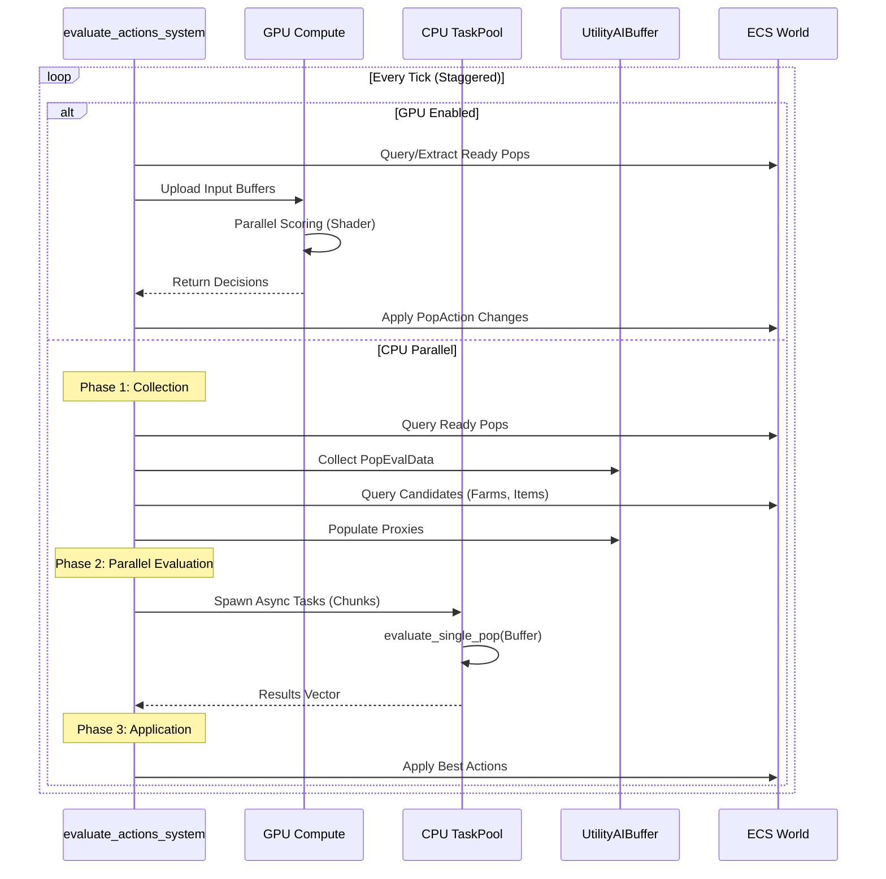
```mermaid
sequenceDiagram
    participant System as evaluate_actions_system
    participant GPU as GPU Compute
    participant TaskPool as CPU TaskPool
    participant Buffer as UtilityAIBuffer
    participant World as ECS World

    loop Every Tick (Staggered)
        alt GPU Enabled
            System->>World: Query/Extract Ready Pops
            System->>GPU: Upload Input Buffers
            GPU->>GPU: Parallel Scoring (Shader)
            GPU-->>System: Return Decisions
            System->>World: Apply PopAction Changes
        else CPU Parallel
            Note over System: Phase 1: Collection
            System->>World: Query Ready Pops
            System->>Buffer: Collect PopEvalData
            System->>World: Query Candidates (Farms, Items)
            System->>Buffer: Populate Proxies

            Note over System: Phase 2: Parallel Evaluation
            System->>TaskPool: Spawn Async Tasks (Chunks)
            TaskPool->>TaskPool: evaluate_single_pop(Buffer)
            TaskPool-->>System: Results Vector

            Note over System: Phase 3: Application
            System->>World: Apply Best Actions
        end
    end
```

## Atmospheric & Ventilation Flow

The simulation handles fluid dynamics (Pollution, Pressure) and entity movement through a centralized logic in `BuildingType`.

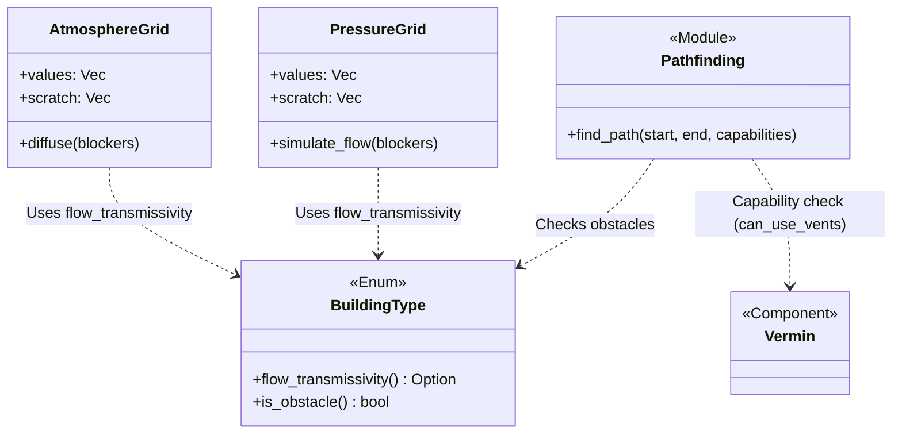
```mermaid
classDiagram
    class AtmosphereGrid {
        +values: Vec<f32>
        +scratch: Vec<f32>
        +diffuse(blockers)
    }
    class PressureGrid {
        +values: Vec<f32>
        +scratch: Vec<f32>
        +simulate_flow(blockers)
    }
    class BuildingType {
        <<Enum>>
        +flow_transmissivity() Option<f32>
        +is_obstacle() bool
    }
    class Pathfinding {
        <<Module>>
        +find_path(start, end, capabilities)
    }
    class Vermin {
        <<Component>>
    }

    AtmosphereGrid ..> BuildingType : Uses flow_transmissivity
    PressureGrid ..> BuildingType : Uses flow_transmissivity
    Pathfinding ..> BuildingType : Checks obstacles
    Pathfinding ..> Vermin : Capability check (can_use_vents)
```

## Technology Architecture

Data Physicality splits technology into "Knowledge" (Software) and "Capacity" (Hardware). Tech unlocks require storage space; exceeding capacity triggers corruption.

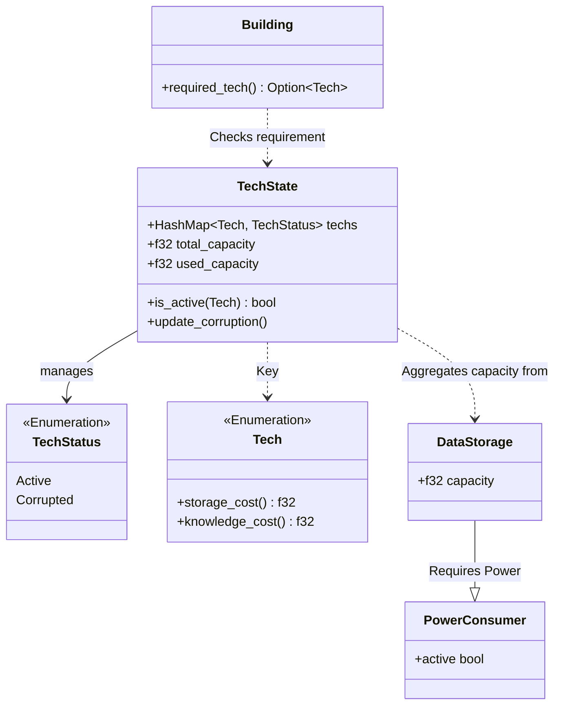
```mermaid
classDiagram
    class TechState {
        +HashMap~Tech, TechStatus~ techs
        +f32 total_capacity
        +f32 used_capacity
        +is_active(Tech) bool
        +update_corruption()
    }
    class TechStatus {
        <<Enumeration>>
        Active
        Corrupted
    }
    class Tech {
        <<Enumeration>>
        +storage_cost() f32
        +knowledge_cost() f32
    }
    class DataStorage {
        +f32 capacity
    }
    class Building {
        +required_tech() Option~Tech~
    }
    class PowerConsumer {
        +active bool
    }

    TechState --> TechStatus : manages
    TechState ..> DataStorage : Aggregates capacity from
    DataStorage --|> PowerConsumer : Requires Power
    Building ..> TechState : Checks requirement
    TechState ..> Tech : Key
```

### Corruption Cascade

When power fails or servers are destroyed, capacity drops, forcing a "Corruption Cascade" that disables high-tech systems.

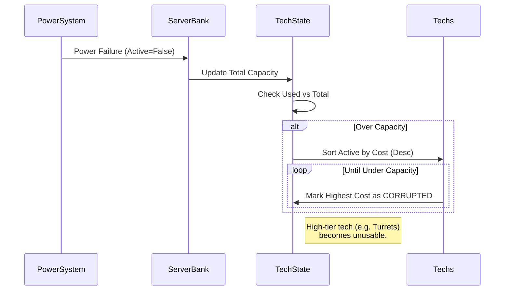
```mermaid
sequenceDiagram
    participant PowerSystem
    participant ServerBank
    participant TechState
    participant Techs

    PowerSystem->>ServerBank: Power Failure (Active=False)
    ServerBank->>TechState: Update Total Capacity
    TechState->>TechState: Check Used vs Total

    alt Over Capacity
        TechState->>Techs: Sort Active by Cost (Desc)
        loop Until Under Capacity
            Techs->>TechState: Mark Highest Cost as CORRUPTED
        end
    end

    Note right of TechState: High-tier tech (e.g. Turrets) <br/> becomes unusable.
```

## UI Inspector Flow

The Inspector pattern allows detailed viewing of entities without coupling the UI to specific entity types.

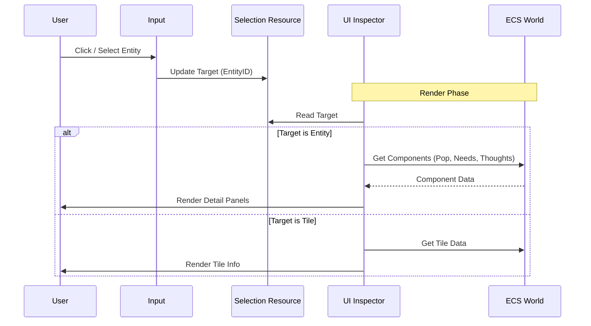
```mermaid
sequenceDiagram
    participant User
    participant Input
    participant Selection as Selection Resource
    participant Inspector as UI Inspector
    participant World as ECS World

    User->>Input: Click / Select Entity
    Input->>Selection: Update Target (EntityID)

    Note over Inspector, World: Render Phase
    Inspector->>Selection: Read Target
    alt Target is Entity
        Inspector->>World: Get Components (Pop, Needs, Thoughts)
        World-->>Inspector: Component Data
        Inspector->>User: Render Detail Panels
    else Target is Tile
        Inspector->>World: Get Tile Data
        Inspector->>User: Render Tile Info
    end
```

## Platform Abstraction

SCALE supports both native (terminal) and web (browser) execution through a platform abstraction layer.

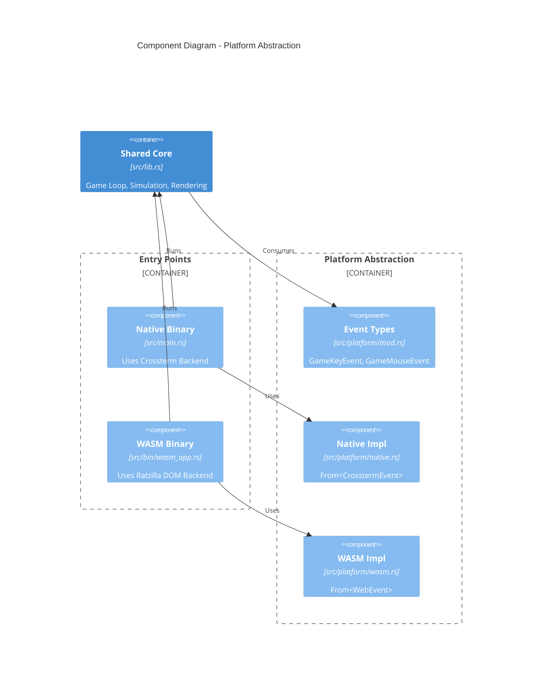
```mermaid
C4Component
title Component Diagram - Platform Abstraction

Container_Boundary(EntryPoints, "Entry Points") {
    Component(Main, "Native Binary", "src/main.rs", "Uses Crossterm Backend")
    Component(Wasm, "WASM Binary", "src/bin/wasm_app.rs", "Uses Ratzilla DOM Backend")
}

Container_Boundary(Platform, "Platform Abstraction") {
    Component(Events, "Event Types", "src/platform/mod.rs", "GameKeyEvent, GameMouseEvent")
    Component(NativeImpl, "Native Impl", "src/platform/native.rs", "From<CrosstermEvent>")
    Component(WasmImpl, "WASM Impl", "src/platform/wasm.rs", "From<WebEvent>")
}

Container(Shared, "Shared Core", "src/lib.rs", "Game Loop, Simulation, Rendering")

Rel(Main, NativeImpl, "Uses")
Rel(Wasm, WasmImpl, "Uses")
Rel(Main, Shared, "Runs")
Rel(Wasm, Shared, "Runs")
Rel(Shared, Events, "Consumes")
```

## Nature Sub-module Extraction

The simulation separated environmental physics and foundational logic out of the massive `layer1::mod` into a distinct `layer1::nature` module.

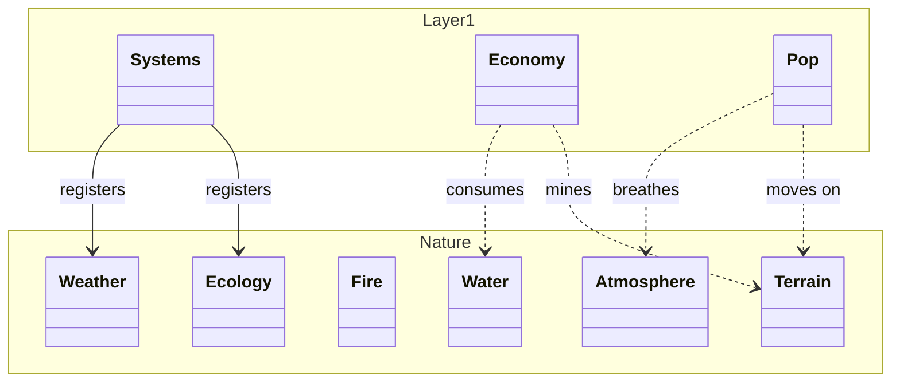
```mermaid
classDiagram
    namespace Layer1 {
        class Systems
        class Economy
        class Pop
    }

    namespace Nature {
        class Atmosphere
        class Weather
        class Fire
        class Terrain
        class Water
        class Ecology
    }

    Systems --> Weather : registers
    Systems --> Ecology : registers
    Pop ..> Atmosphere : breathes
    Pop ..> Terrain : moves on
    Economy ..> Water : consumes
    Economy ..> Terrain : mines
```

## Tuple Limit Workaround

When adding systems to a schedule via Bevy's `add_systems()`, macro limitations restrict tuple sizes to 21 elements. Overloaded phases like `Observation` handle this by splitting the tuples.

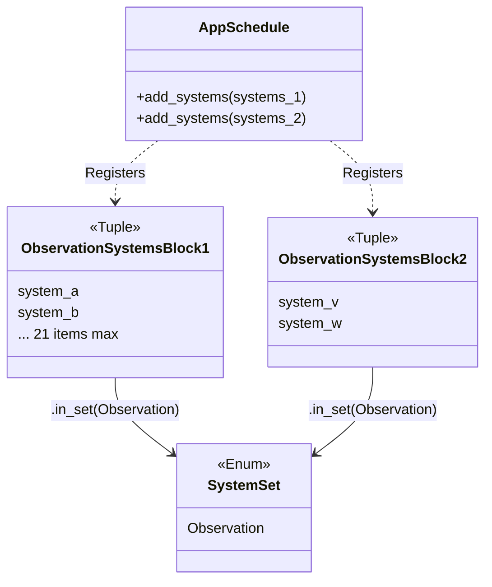
```mermaid
classDiagram
    class SystemSet {
        <<Enum>>
        Observation
    }

    class AppSchedule {
        +add_systems(systems_1)
        +add_systems(systems_2)
    }

    class ObservationSystemsBlock1 {
        <<Tuple>>
        system_a
        system_b
        ... 21 items max
    }

    class ObservationSystemsBlock2 {
        <<Tuple>>
        system_v
        system_w
    }

    ObservationSystemsBlock1 --> SystemSet : .in_set(Observation)
    ObservationSystemsBlock2 --> SystemSet : .in_set(Observation)

    AppSchedule ..> ObservationSystemsBlock1 : Registers
    AppSchedule ..> ObservationSystemsBlock2 : Registers
```

## Related Decisions

- [ADR 001: Layered Architecture](./adr/001-layered-architecture.md)
- [ADR 002: ECS-TUI Hybrid](./adr/002-ecs-tui-hybrid.md)
- [ADR 003: YAGNI - Excision of Layers 2 and 3](./adr/003-yagni-excision-of-layers-2-and-3.md)
- [ADR 004: Modular UI Architecture](./adr/004-modular-ui-architecture.md)
- [ADR 005: Adopt Emergent Utility AI](./adr/005-adopt-emergent-utility-ai.md)
- [ADR 006: WASM Browser Support](./adr/006-wasm-browser-support.md)
- [ADR 008: Modular Utility AI Structure](./adr/008-modular-utility-ai.md)
- [ADR 012: Decouple Storage from Core](./adr/012-storage-split.md)
- [ADR 013: GPU Accelerated Utility AI](./adr/013-gpu-accelerated-utility-ai.md)
- [ADR 014: Cabin Fever Mechanics](./adr/014-cabin-fever-mechanics.md)
- [ADR 015: Experimental Feature Flags](./adr/015-experimental-feature-flags.md)
- [ADR 016: Layer 2 Bridge Strategy](./adr/016-layer-2-bridge.md)
- [ADR 017: Input Context Stack](./adr/017-input-context-stack.md)
- [ADR 018: Faction System & State Injection](./adr/018-faction-system-architecture.md)
- [ADR 019: Decoupled Camera Interpolation](./adr/019-decoupled-camera-interpolation.md)
- [ADR 020: Spontaneous Architecture](./adr/020-spontaneous-architecture.md)
- [ADR 022: Atmospheric & Ventilation Flow](./adr/022-atmospheric-flow-architecture.md)
- [ADR 023: Data Physicality & Tech Corruption](./adr/023-data-physicality.md)
- [ADR 024: Visual Particle System](./adr/024-visual-particle-system.md)
- [ADR 025: Integrated Feature Flags](./adr/025-integrated-feature-flags.md)
- [ADR 026: CPU Parallel Utility AI](./adr/026-cpu-parallel-utility-ai.md)
- [ADR 027: Job System Simplification](./adr/027-job-system-simplification.md)
- [ADR 028: Seismic System Split](./adr/028-seismic-system-split.md)
- [ADR 029: Refactor Logistics into Submodules](./adr/029-refactor-logistics-into-submodules.md)
- [ADR 030: Layer 1 System Architecture Refactor](./adr/030-layer-1-system-architecture.md)
- [ADR 031: Layer 2 Revival & Lightweight Simulation](./adr/031-layer-2-revival.md)
- [ADR 032: Rename check_access to check_security_clearance](./adr/032-rename-check-access-to-check-security-clearance.md)
- [ADR 033: Extract Actions to Submodule](./adr/033-extract-actions-to-submodule.md)
- [ADR 034: Decouple Pop/Execution from UtilityAI](./adr/034-decouple-pop-execution-from-utility-ai.md)
- [ADR 035: Extract Nature Sub-module](./adr/035-extract-nature-submodule.md)
- [ADR 036: Split Overloaded System Tuples](./adr/036-split-overloaded-system-tuples.md)
- [ADR 037: Headless CLI Dashboard](./adr/037-headless-cli-dashboard.md)
- [ADR 038: Encapsulate Secret Societies](./adr/038-encapsulate-secret-societies.md)
- [ADR 039: Integrate Gut Biome Mechanics](./adr/039-integrate-gut-biome.md)
- [ADR 040: Consolidate Geology Module](./adr/040-consolidate-geology-module.md)
- [ADR 041: Encapsulate Tech Submodules](./adr/041-encapsulate-tech-submodules.md)
- [ADR 042: Refactor Building God Module](./adr/042-refactor-building-module.md)
- [ADR 043: Encapsulate Social Mechanics](./adr/043-encapsulate-social-mechanics.md)

## Tech Module Encapsulation

The internal mechanisms of the `tech` module (like `ghost_code`, `machine_awakening`, and `infinite_archive`) were encapsulated by restricting visibility to `pub(crate)` within their submodules. This prevents leaky abstractions and enforces strict module boundaries.

```mermaid
classDiagram
    namespace Layer1 {
        class Systems
        class Economy
    }

    namespace Tech {
        class TechState
        class GhostCode
        class MachineAwakening
        class InfiniteArchive
    }

    Layer1 --> TechState : interacts via public API
    TechState ..> GhostCode : uses internal logic (pub(crate))
    TechState ..> MachineAwakening : uses internal logic (pub(crate))
    TechState ..> InfiniteArchive : uses internal logic (pub(crate))
```

## Building God Module Refactor

The massive `building.rs` monolith containing the `spawn_building` god function was extracted into a cleaner facade structure. The configuration logic was moved into the highly cohesive `configuration.rs` submodule.

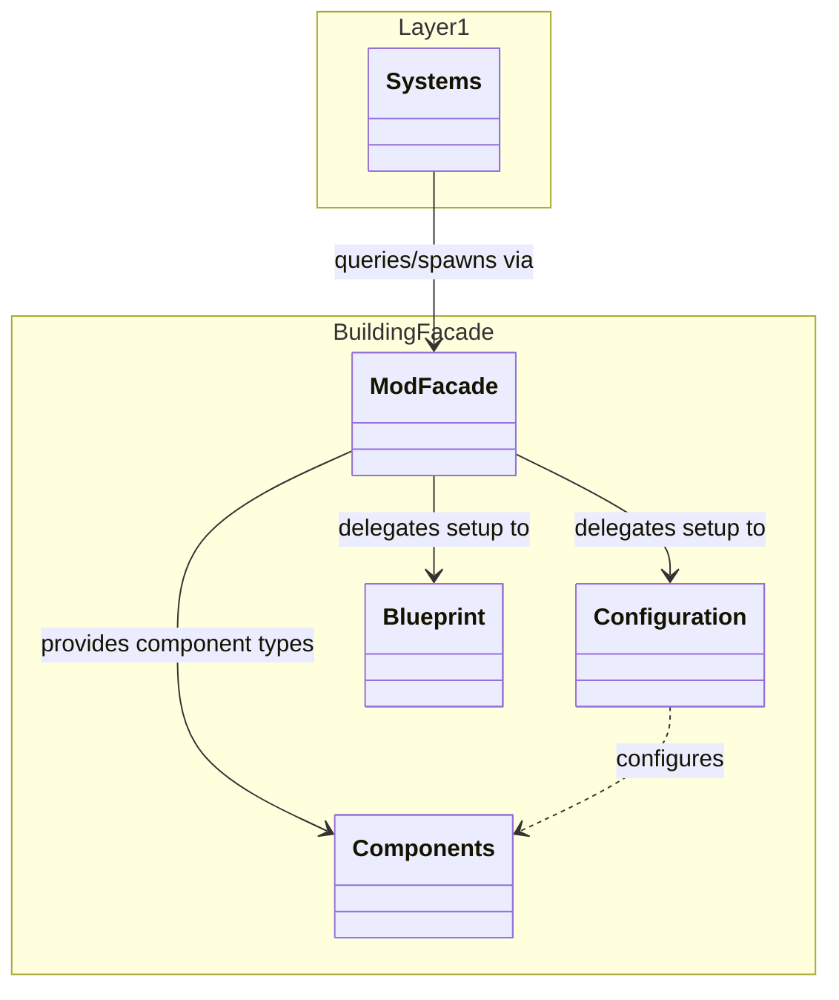
```mermaid
classDiagram
    namespace Layer1 {
        class Systems
    }

    namespace BuildingFacade {
        class ModFacade
        class Configuration
        class Blueprint
        class Components
    }

    Systems --> ModFacade : queries/spawns via
    ModFacade --> Configuration : delegates setup to
    ModFacade --> Blueprint : delegates setup to
    ModFacade --> Components : provides component types
    Configuration ..> Components : configures
```

## Social Mechanics Encapsulation

The simulation separated numerous social mechanics (Secret Societies, Debt, Grievances, Old Guard, etc.) into a distinct `layer1::social` module to enforce domain boundaries and clean up the root `layer1` namespace.

```mermaid
classDiagram
    namespace Layer1 {
        class Systems
        class Economy
        class Pop
    }

    namespace Social {
        class SecretSocieties
        class Debt
        class Grievances
        class OldGuard
        class EmptyRoom
        class CulturalVandalism
        class Unrest
        class Needs
    }

    Layer1 --> Social : initializes
    Social --> Pop : modifies
    SecretSocieties --> Unrest : generates
    Grievances --> Unrest : generates
    Debt --> Needs : impacts
```
