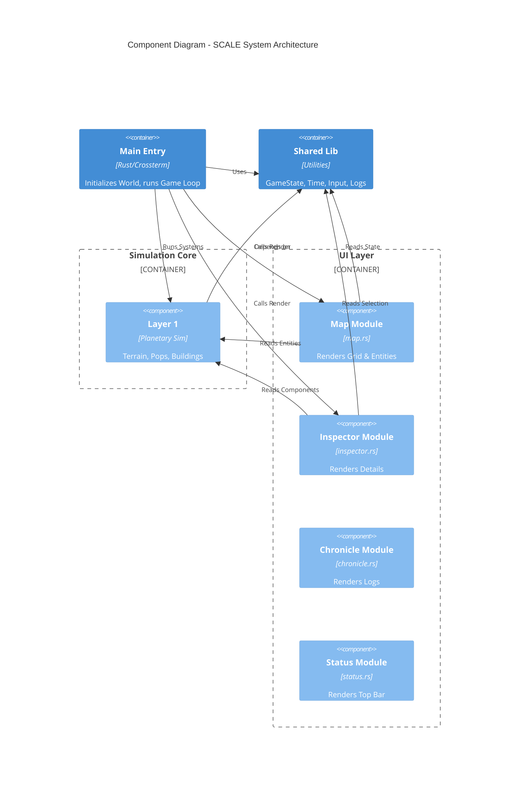
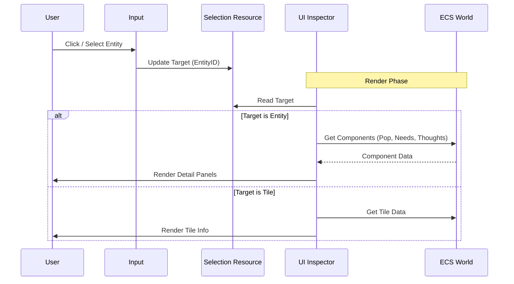

# SCALE Architecture

This document maps the high-level architecture of the SCALE project.

## High-Level Components

## The Game Loop

SCALE uses a hybrid architecture: `bevy_ecs` for logic and `ratatui` for rendering, managed by a custom loop.

```mermaid
sequenceDiagram
    participant User
    participant Main
    participant Input as InputRouter
    participant ECS as Bevy World
    participant UI as TUI Layer

    loop Every Frame
        User->>Main: Key Press (Event)
        Main->>Input: route(key)
        Input->>ECS: Update Resources/Components

        opt Simulation Tick
            Main->>ECS: run_schedule()
            ECS->>ECS: Systems Update (Produce Food, Move, etc.)
        end

        Main->>UI: render(world, frame)

        rect rgb(30, 30, 30)
            note right of UI: UI Rendering Phase
            UI->>ECS: Query Selection
            UI->>ECS: Query Map/Entities
            ECS-->>UI: Data
            UI-->>User: Draw Widgets
        end
    end
```

## UI Inspector Flow

The Inspector pattern allows detailed viewing of entities without coupling the UI to specific entity types.

## Related Decisions

- [ADR 001: Layered Architecture](./adr/001-layered-architecture.md)
- [ADR 002: ECS-TUI Hybrid](./adr/002-ecs-tui-hybrid.md)
- [ADR 003: YAGNI - Excision of Layers 2 and 3](./adr/003-yagni-excision-of-layers-2-and-3.md)
- [ADR 004: Modular UI Architecture](./adr/004-modular-ui-architecture.md)
