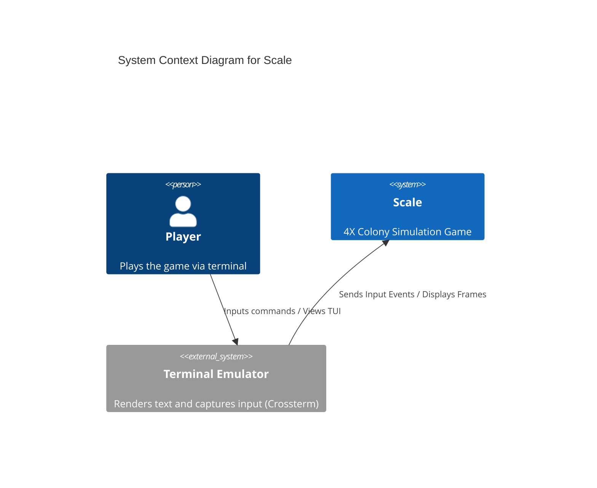
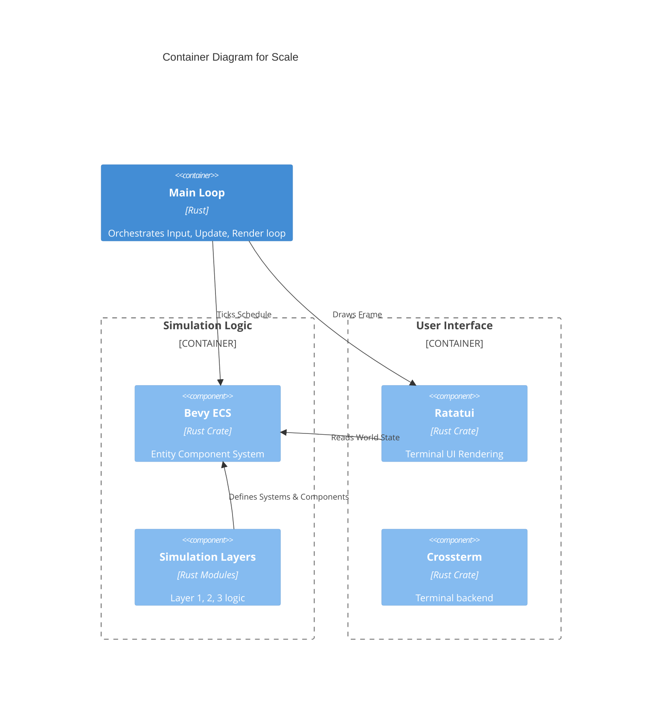
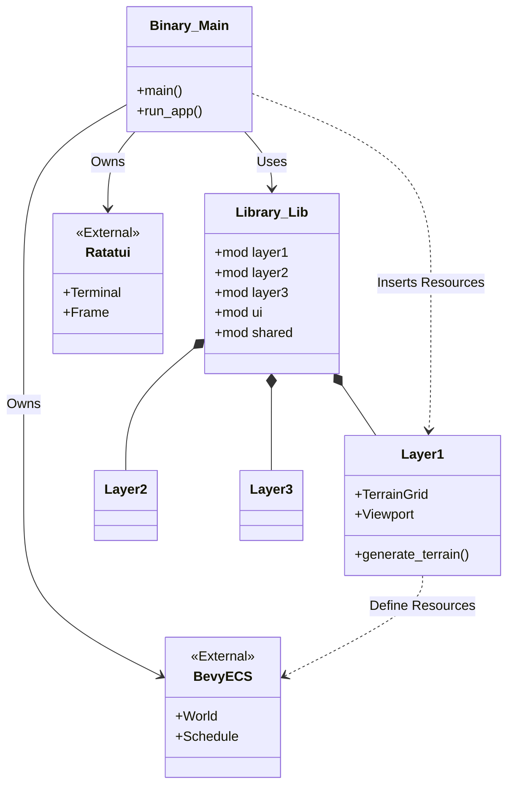

# Architecture

This document describes the high-level architecture of the **Scale** project.

## System Context (C4 Level 1)

The system is a standalone terminal application.

## Container Diagram (C4 Level 2)

The application is a single executable composed of the Simulation Engine and the TUI Layer.

## Module Structure (Class Diagram)

This diagram shows the static code organization.

