# SCALE Architecture

This document maps the high-level architecture of the SCALE project.

## High-Level Components

```mermaid
C4Component
title Component Diagram - SCALE System Architecture

Container(Main, "Main Entry", "Rust/Crossterm", "Initializes World, runs Game Loop")

Container_Boundary(Simulation, "Simulation Core (Layer 1)") {
    Component(UtilityOrchestrator, "Utility Orchestrator", "utility_ai.rs", "Coordinates Decision Cycle")
    Component(GPU, "GPU Compute", "gpu/evaluate.rs", "Parallel Scoring")
    Component(Actions, "Action Modules", "layer1/actions/*.rs", "Generic Actions")
    Component(DomainActions, "Domain Actions", "medical.rs, funeral.rs", "Specific Logic")

    Component(Pops, "Pops", "pop.rs", "Agents with Needs & Thoughts")
    Component(Factions, "Factions", "factions.rs", "Guilds & Strikes")
    Component(SpontaneousArch, "Spontaneous Arch", "spontaneous_architecture.rs", "Agent Building")
    Component(CabinFever, "Cabin Fever System", "cabin_fever.rs", "Tracks Confinement & Crowding")
    Component(Acoustics, "Acoustics (Nova)", "acoustics.rs", "Noise Map & Weather Audio")
    Component(Atmosphere, "Atmosphere", "atmosphere.rs", "Pollution Diffusion")
    Component(Pressure, "Pressure", "pressure.rs", "Decompression")
    Component(Pathfinding, "Pathfinding", "pathfinding.rs", "A* with Capabilities")
    Component(World, "World Entities", "farm.rs, housing.rs", "Interactable Buildings")
    Component(Resources, "Colony Resources", "resources.rs", "Global Inventory")
    Component(Map, "Map/Terrain", "map.rs", "Spatial Grid")

    Component(Particles, "Particle System", "particles.rs", "Visual Juice & Sub-grid Physics")
    Component(NovaFeatures, "Nova Features", "constellations.rs, observer.rs", "Experimental Mechanics")
}

Container(Shared, "Shared Lib", "Utilities", "GameState, Time, Input, Logs")
Container(Storage, "Storage Crate", "Persistence", "Handles Save/Load")

Container_Boundary(SharedLib, "Shared Components") {
    Component(InputStack, "Input Context Stack", "input.rs", "Modal Input Handling")
}

Container_Boundary(UI, "UI Layer") {
    Component(MapRender, "Map Module", "map.rs", "Renders Grid & Entities")
    Component(Inspector, "Inspector Module", "inspector.rs", "Renders Details")
    Component(Chronicle, "Chronicle Module", "chronicle.rs", "Renders Logs")
    Component(Status, "Status Module", "status.rs", "Renders Top Bar")
}

Rel(Main, Shared, "Uses")
Rel(Main, Storage, "Uses")
Rel(Main, UtilityOrchestrator, "Runs Systems")
Rel(UtilityOrchestrator, GPU, "Dispatches Work")
Rel(Main, MapRender, "Calls Render")

Rel(UtilityOrchestrator, Actions, "Calls evaluate_*")
Rel(UtilityOrchestrator, DomainActions, "Calls evaluate_*")
Rel(UtilityOrchestrator, Pops, "Reads/Writes")
Rel(UtilityOrchestrator, World, "Queries Availability")
Rel(UtilityOrchestrator, Map, "Calculates Distance")
Rel(UtilityOrchestrator, Pathfinding, "Calculates Path")

Rel(Actions, Particles, "Spawns")
Rel(DomainActions, Particles, "Spawns")

Rel(Pops, World, "Interacts with")
Rel(Pops, Factions, "Member Of")
Rel(Pops, Resources, "Consumes/Produces")
Rel(Pops, CabinFever, "Accumulates Stress")
Rel(Pops, Acoustics, "Reacts to Noise")
Rel(Pops, SpontaneousArch, "Builds")
Rel(Pops, Atmosphere, "Takes Damage")
Rel(Pops, Pressure, "Moved by Force")
Rel(Pops, NovaFeatures, "Affected By")

Rel(MapRender, Shared, "Reads State")
Rel(MapRender, Map, "Reads Entities")
Rel(Inspector, Shared, "Reads Selection")
Rel(Inspector, Pops, "Reads Components")
```

## Core Dependencies

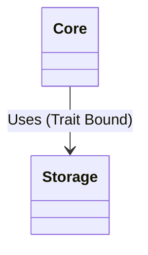

### Persistence Flow

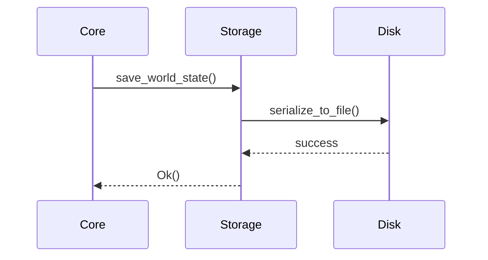

## Layer 2 Bridge

The interface between the Colony Simulation (Layer 1) and the Orbital/System Data (Layer 2).

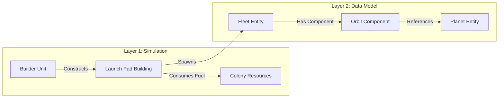

## The Game Loop

SCALE uses a hybrid architecture: `bevy_ecs` for logic and `ratatui` for rendering, managed by a custom loop.

```mermaid
sequenceDiagram
    participant User
    participant Main
    participant Input as InputContextStack
    participant ECS as Bevy World
    participant UI as TUI Layer

    loop Every Frame
        User->>Main: Key Press (Event)
        Main->>Input: route(key) -> active_context
        Input->>ECS: Update Resources/Components

        opt Simulation Tick
            Main->>ECS: run_schedule()
            ECS->>ECS: Systems Update (Utility AI, Refining, Acoustics)
        end

        Main->>ECS: update_camera_smooth()
        Main->>UI: render(world, frame)

        rect rgb(30, 30, 30)
            note right of UI: UI Rendering Phase
            UI->>ECS: Query Selection
            UI->>ECS: Query Map/Entities
            ECS-->>UI: Data
            UI-->>User: Draw Widgets
        end
    end
```

## Utility AI Decision Loop

The "Brain" of the simulation. Pops decide what to do based on internal needs and external context.

```mermaid
sequenceDiagram
    participant System as evaluate_actions_system
    participant GPU as GPU Compute
    participant Pop as Pop Entity
    participant Needs as Needs Component
    participant World as World State
    participant Memory as Utility Weights

    loop Every Tick (Staggered)
        alt GPU Enabled
            System->>World: Query/Extract Ready Pops
            System->>GPU: Upload Input Buffers
            GPU->>GPU: Parallel Scoring (Shader)
            GPU-->>System: Return Decisions
            System->>Pop: Update PopAction (Batch)
        else CPU Fallback
            System->>Pop: Check Commitment Timer
            alt Timer Expired
                System->>Needs: Read Hunger/Rest
                Needs-->>System: Urgency Scores

                rect rgb(40, 40, 50)
                    Note right of System: Evaluation Phase
                    System->>World: Query Entities (Farms, Items, etc.)

                    System->>System: Call evaluate_satisfy_hunger()
                    System->>System: Call evaluate_work()
                    System->>System: Call evaluate_haul()

                    Note over System: Actions typically return Option<(Score, Target)>
                    System->>System: Select Best Utility
                end

                System->>Pop: Update PopAction (Best Score)
            else Timer Active
                System->>Pop: Continue Current Action
            end
        end
    end
```

## Atmospheric & Ventilation Flow

The simulation handles fluid dynamics (Pollution, Pressure) and entity movement through a centralized logic in `BuildingType`.

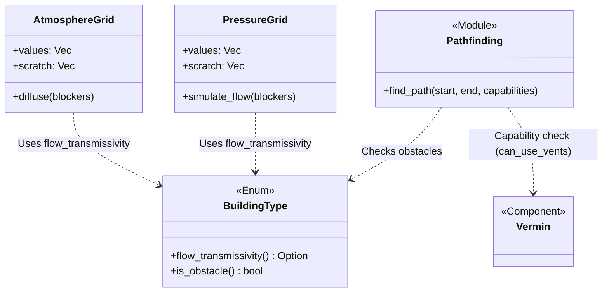

## Technology Architecture

Data Physicality splits technology into "Knowledge" (Software) and "Capacity" (Hardware). Tech unlocks require storage space; exceeding capacity triggers corruption.

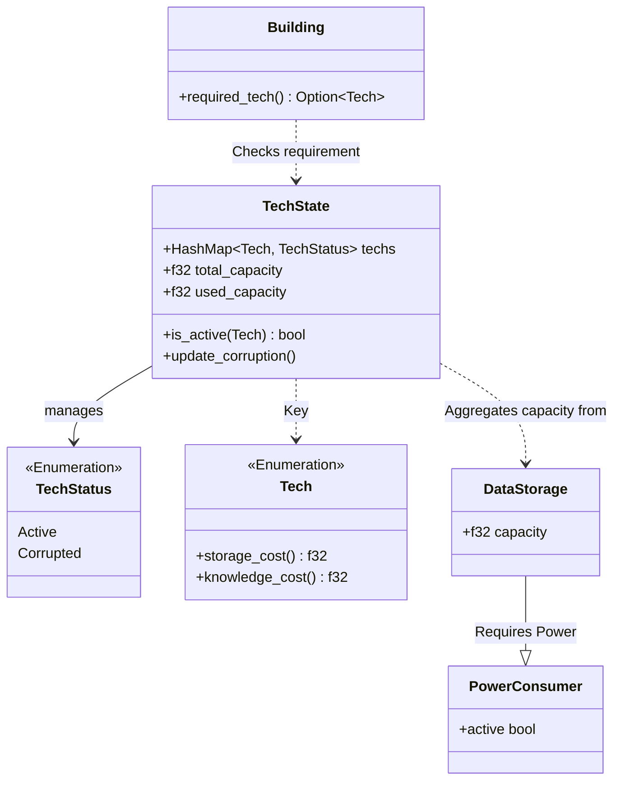

### Corruption Cascade

When power fails or servers are destroyed, capacity drops, forcing a "Corruption Cascade" that disables high-tech systems.

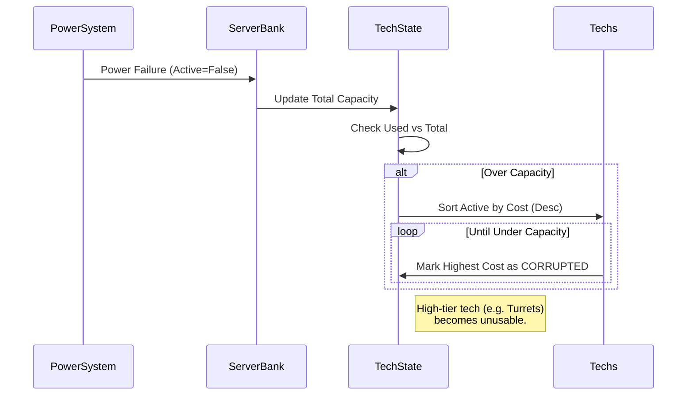

## UI Inspector Flow

The Inspector pattern allows detailed viewing of entities without coupling the UI to specific entity types.

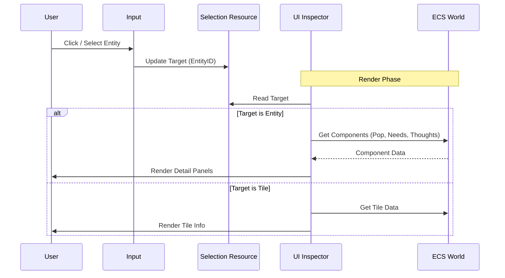

## Platform Abstraction

SCALE supports both native (terminal) and web (browser) execution through a platform abstraction layer.

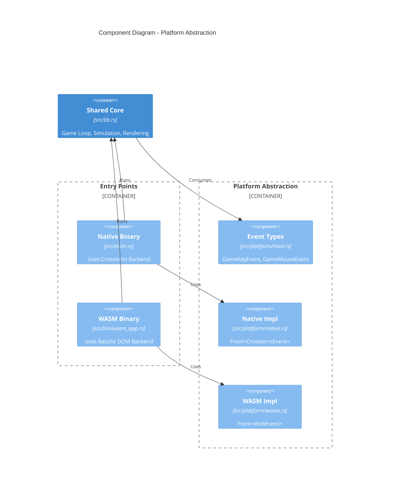

## Related Decisions

- [ADR 001: Layered Architecture](./adr/001-layered-architecture.md)
- [ADR 002: ECS-TUI Hybrid](./adr/002-ecs-tui-hybrid.md)
- [ADR 003: YAGNI - Excision of Layers 2 and 3](./adr/003-yagni-excision-of-layers-2-and-3.md)
- [ADR 004: Modular UI Architecture](./adr/004-modular-ui-architecture.md)
- [ADR 005: Adopt Emergent Utility AI](./adr/005-adopt-emergent-utility-ai.md)
- [ADR 006: WASM Browser Support](./adr/006-wasm-browser-support.md)
- [ADR 008: Modular Utility AI Structure](./adr/008-modular-utility-ai.md)
- [ADR 012: Decouple Storage from Core](./adr/012-decouple-storage-from-core.md)
- [ADR 013: GPU Accelerated Utility AI](./adr/013-gpu-accelerated-utility-ai.md)
- [ADR 014: Cabin Fever Mechanics](./adr/014-cabin-fever-mechanics.md)
- [ADR 015: Experimental Feature Flags](./adr/015-experimental-feature-flags.md)
- [ADR 016: Layer 2 Bridge Strategy](./adr/016-layer-2-bridge.md)
- [ADR 017: Input Context Stack](./adr/017-input-context-stack.md)
- [ADR 018: Faction System & State Injection](./adr/018-faction-system-architecture.md)
- [ADR 019: Decoupled Camera Interpolation](./adr/019-decoupled-camera-interpolation.md)
- [ADR 020: Spontaneous Architecture](./adr/020-spontaneous-architecture.md)
- [ADR 022: Atmospheric & Ventilation Flow](./adr/022-atmospheric-flow-architecture.md)
- [ADR 023: Data Physicality & Tech Corruption](./adr/023-data-physicality.md)
- [ADR 024: Visual Particle System](./adr/024-visual-particle-system.md)
- [ADR 025: Integrated Feature Flags](./adr/025-integrated-feature-flags.md)
