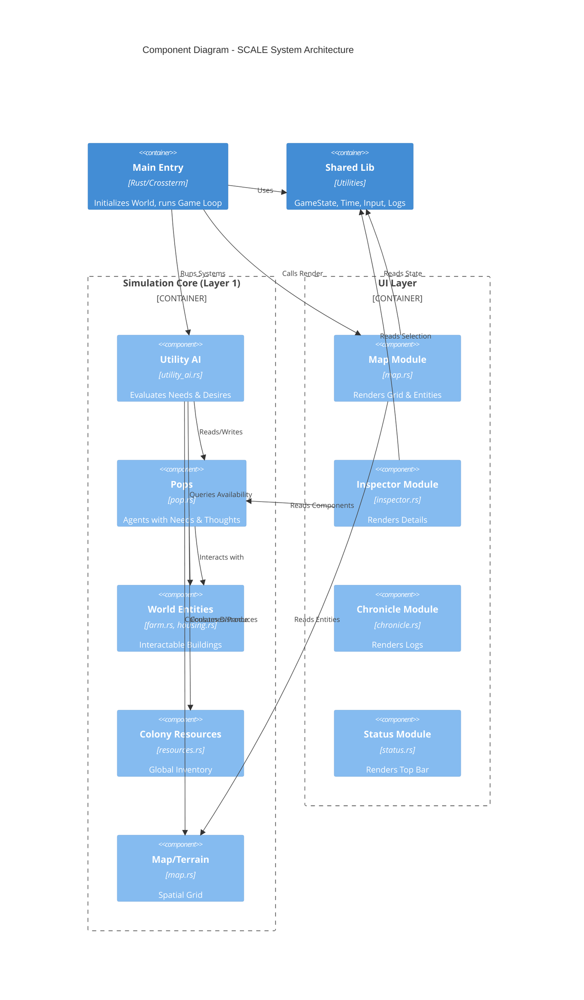
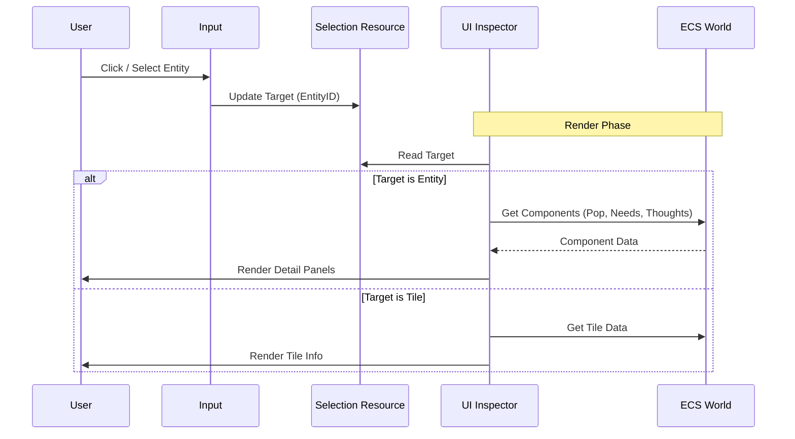
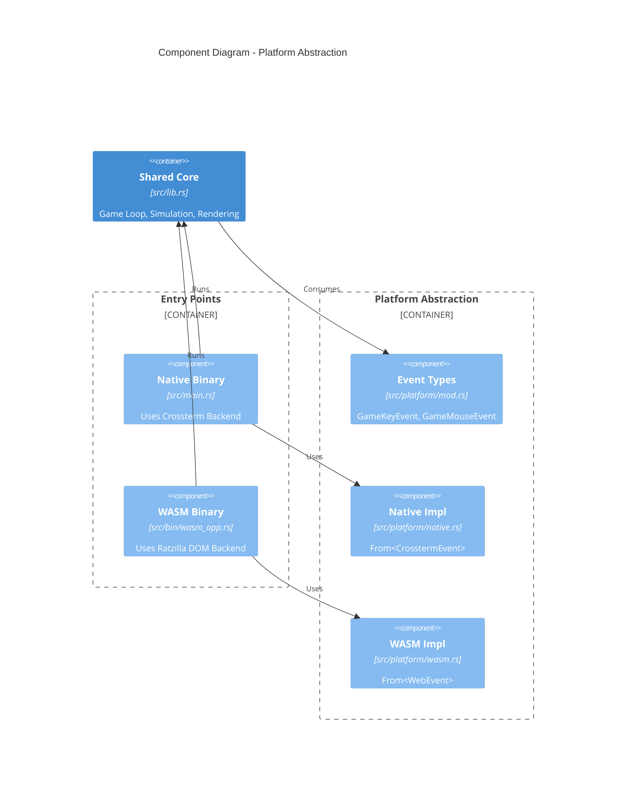

# SCALE Architecture

This document maps the high-level architecture of the SCALE project.

## High-Level Components

## The Game Loop

SCALE uses a hybrid architecture: `bevy_ecs` for logic and `ratatui` for rendering, managed by a custom loop.

```mermaid
sequenceDiagram
    participant User
    participant Main
    participant Input as InputRouter
    participant ECS as Bevy World
    participant UI as TUI Layer

    loop Every Frame
        User->>Main: Key Press (Event)
        Main->>Input: route(key)
        Input->>ECS: Update Resources/Components

        opt Simulation Tick
            Main->>ECS: run_schedule()
            ECS->>ECS: Systems Update (Utility AI, Refining, etc.)
        end

        Main->>UI: render(world, frame)

        rect rgb(30, 30, 30)
            note right of UI: UI Rendering Phase
            UI->>ECS: Query Selection
            UI->>ECS: Query Map/Entities
            ECS-->>UI: Data
            UI-->>User: Draw Widgets
        end
    end
```

## Utility AI Decision Loop

The "Brain" of the simulation. Pops decide what to do based on internal needs and external context.

```mermaid
sequenceDiagram
    participant System as evaluate_actions_system
    participant Pop as Pop Entity
    participant Needs as Needs Component
    participant World as World State
    participant Memory as Utility Weights

    loop Every Tick (Staggered)
        System->>Pop: Check Commitment Timer
        alt Timer Expired
            System->>Needs: Read Hunger/Rest
            Needs-->>System: Urgency Scores

            rect rgb(40, 40, 50)
                Note right of System: Evaluation Phase
                System->>World: Query Farms/Housing
                System->>Memory: Get Learned Weights
                System->>System: Calculate Utility (Action = Urgency * Context * Weight)
            end

            System->>Pop: Update PopAction (Best Score)
        else Timer Active
            System->>Pop: Continue Current Action
        end
    end
```

## UI Inspector Flow

The Inspector pattern allows detailed viewing of entities without coupling the UI to specific entity types.

## Platform Abstraction

SCALE supports both native (terminal) and web (browser) execution through a platform abstraction layer.

## Related Decisions

- [ADR 006: WASM Browser Support](./adr/006-wasm-browser-support.md)
- [ADR 001: Layered Architecture](./adr/001-layered-architecture.md)
- [ADR 002: ECS-TUI Hybrid](./adr/002-ecs-tui-hybrid.md)
- [ADR 003: YAGNI - Excision of Layers 2 and 3](./adr/003-yagni-excision-of-layers-2-and-3.md)
- [ADR 004: Modular UI Architecture](./adr/004-modular-ui-architecture.md)
- [ADR 005: Adopt Emergent Utility AI](./adr/005-adopt-emergent-utility-ai.md)
